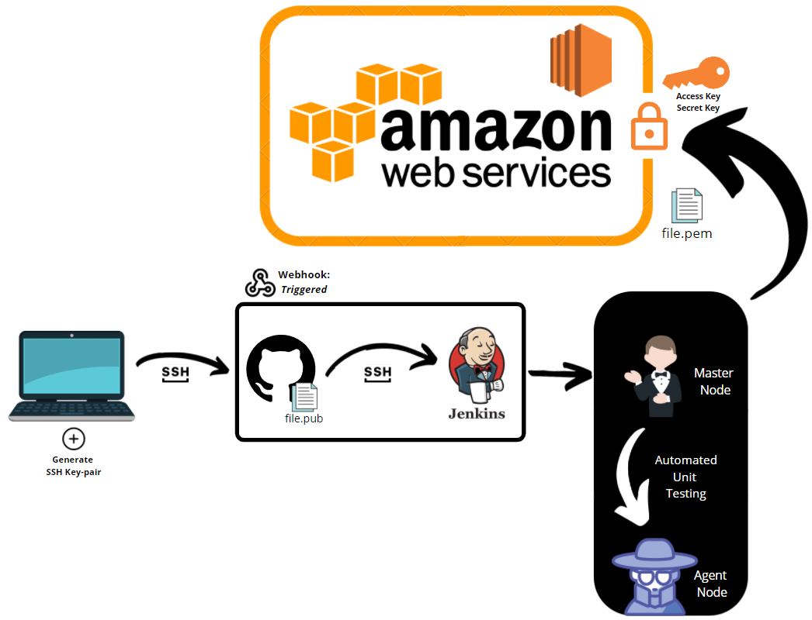

# CI/CD

Could you explain CI/CD?:
- Continuous Integration is partly a culture that involves frequent code commits and updates, rather than occasional large commits. 
- On top of that, the push should automatically integrate the data from localhost onto github and straight onto the AWS instance without your own manual interaction with the instances. 
- CD stands for either continuous delivery or continuous deployment, depending on how the user wants to approach their pipeline. 
- These both involve automation of further stages of the pipeline. 
- Continuous delivery means that the changes that are uploaded to the repository via continuous integration are automatically bug tested (such as via Jenkins) and then uploaded on the final instance, such as in AWS storage, where the operations team can manually deploy the changes to live. 
- Continuous deployment is the same as continuous delivery, except it's automatically uploaded to the live instance rather than letting the operations team manually handle it, effectively automating the final step that continuous delivery leaves to the operations team.


<br><br>
# Creating an SSH Connection

1. Generate SSH key-pair on localhost.
2. Put the lock onto GitHub, copying the public SSH key onto GitHub.
3. Create a new repo for CICD on our GitHub.
4. Use your ssh key to push changes locally into the SSH key-protected repository.

- file.pub - key to get into github account using secure shell
1. 
    - `ssh-keygen -t rsa -b 4096 -C "your_email@example.com"`
    - Generates SSH key-pair.
    - Enter file in which to save key without writing anything.
    - Enter passphrase (empty if none).
    - Generates .pub file which is the key.
2. 
    - Go onto your GitHub settings, SSH keys and copy and paste the entire key. 
    - You can list the contents of the key by using the '`cat`' command.
3. 
    - Go to your main GitHub page.
    - Click 'repositories'.
    - Create a new public repository, name it something related to CI/CD.
4. 
    - `git init`
    - `git add .`
    - `git commit -m "first commit"`
    - `git branch -M main`
    - `git remote add origin SSHGITCLONELINKHERE`
    - `git push -u origin main`

# Jenkins

- Jenkins default port is 8080

1. Testing to see if Jenkins works
    - Click "New Item"
    - Select "Freestyle Project"
    - Scroll down to the bottom and click "Add Build Step"
    - Select "Shell Commands"
    - Here, you can enter bash commands that will execute when this build is run, such as `uname -a` and `date`
    - Click 'Apply' and 'Save'
    - Build the item by choosing 'Build Now'
    - Click on the item, select the latest build and view 'Console Output' to see the outpout of the bash commands
2. Testing to see if Jenkins works by chaining two items
    - Follow the previous step right until before you select 'Apply' and 'Save'
    - At the bottom, under 'Post-build Actions', select 'Build other projects'
    - Select the first item you created, and tick "Trigger only if build is stable".
    - Now, when you build the new project, it will run the bash commands, and if everything is successful it will automatically build the first project you designed as well, and execute those commands in the same console output.

# Continuous Integration

1. Set up a new freestyle project item in Jenkins
    - `Discard old builds` - max builds: 3
    - Select `GitHub Project`, copy and paste the clone HTTPS url here
    - Select `Restrict where this project can be run`, and write `sparta-ubuntu-node`

2. Set up a webhook and create an SSH key on GitHub
    - Go to `Settings -> Webhooks -> Add webhook`
    - Copy the URL along with the port of the Jenkins server, with `/github-webhook/` appended to the end, e.g. `http://14.130.53.18:8080/github-webhook/`
    - Write content-type: `application/json`
    - Open Git Bash and write the following code in your new repository for Jenkins' directory:
    - `ssh-keygen -t ed25519 -C "your_email@example.com"`
    - You will be prompted for a filename, keep it empty or write a custom name
    - Press enter twice on the passphrase prompt to keep it empty
        - If you specified a username, enter the following code to add it to the list of SSH keys:
        - `eval "$(ssh-agent -s)"`
        - `ssh-add ~/.ssh/filename`, where `filename` is the filename you specified
    - use the `cat` command to list the contents of your key file in `~/.ssh`, so that you can copy paste it

3. Complete the continuous integration job in Jenkins
    - Continue on from the first step
    - Select the `Git` box
    - Add the GitHub `clone ssh` URL into `Repository URL`
    - Select `Credential -> Add -> Key` and then insert your private key (cat filename without .pub extension for private key on Git Bash)
    - Branches to build: `*/main` OR the specific branch you are working on, such as `*/dev`
    - Build triggers: Select `GitHub hook trigger for GITScm Polling` (this triggers the build as soon as a change is pushed to the repository)
    - In Build Environment, select `Provide Node & npm bin/ folder to PATH` and `SSH Agent` and provide the private key here
    - Under `Build` select `Add build step -> Execute shell commands`:
    ```bash
    cd app
    npm install
    npm test
    ```
    - Finally, select `post-build actions` and write the name of the next item you will create for the continuous delivery job


# Continuous Delivery

1. Set up a new freestyle project in Jenkins
    - `Discard old builds` - max builds: 3
    - Select `GitHub Project`, copy and paste the clone HTTPS url here
    - Select `Restrict where this project can be run`, and write `sparta-ubuntu-node`

2. Finish the continuous delivery job in Jenkins
    - Select the `Git` box
    - Add the GitHub `clone ssh` URL into `Repository URL`
    - Select `Credential -> Add -> Key` and then insert your private key (cat filename without .pub extension for private key on Git Bash)
    - Branches to build: `*/main` OR the specific branch you are working on, such as `*/dev`
    - In Build Environment, select `Provide Node & npm bin/ folder to PATH` and `SSH Agent` and provide the private key here, as well as the SSH keypair to access your AWS instance, should be a .pem file
    - Under `Build` select `Add build step -> Execute shell commands`:
    ```bash
    git checkout main
    git pull origin main
    git merge origin/dev
    git push origin main
    scp -o "StrictHostKeyChecking=no" -v -r app ubuntu@ec2-54-195-167-174.eu-west-1.compute.amazonaws.com:~ 
    ```
    - Except, replace the ssh log-on URLs for the `scp` command

# Continuous Deployment

1. Edit the continuous delivery build shell commands to implement continuous deployment instead
    - Replace the shell commands with: 
    ```bash
    git checkout main
    git pull origin main
    git merge origin/dev
    git push origin main
    scp -o "StrictHostKeyChecking=no" -v -r app ubuntu@ec2-54-195-167-174.eu-west-1.compute.amazonaws.com:~ 
    ssh -o "StrictHostKeyChecking=no" -v -tt ubuntu@ec2-54-195-167-174.eu-west-1.compute.amazonaws.com << EOF
    cd app 
    sudo apt-get update -y
    sudo apt-get upgrade -y
    sudo apt-get install nginx -y
    curl -sL https://deb.nodesource.com/setup_6.x | sudo -E bash -
    sudo apt-get install -y nodejs
    npm install
    screen -d -m npm start
    exit

    EOF
    ```
    - Except, replace the ssh log-on URLs for the `scp` and `ssh` commands
